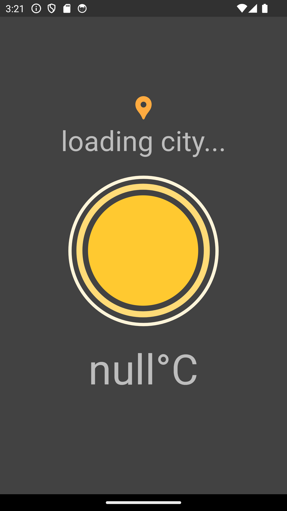
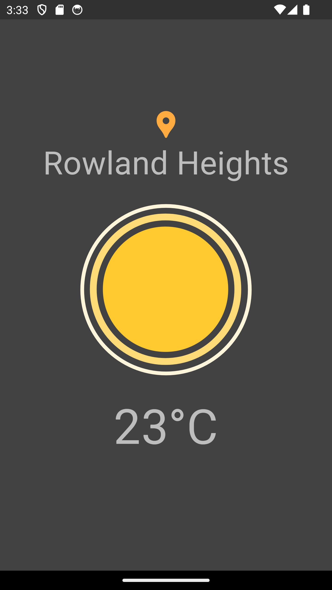

# Weather App

## Overview

Weather App is a Flutter-based mobile application that provides real-time weather updates for your current city. Leveraging the power of the [Lottie](https://pub.dev/packages/lottie) library, the app displays animated weather conditions to give you a visually appealing and engaging experience.

## Screenshots

### Main Screen

### Weather Example

## Features

- **Real-time Weather Updates**: Fetches and displays current weather conditions for your city.
- **Animated Weather Conditions**: Uses Lottie animations to illustrate different weather scenarios.
- **City Location**: Automatically retrieves and displays the weather for your current location.

## Technologies Used

- **Flutter**: Framework for building natively compiled applications for mobile, web, and desktop from a single codebase.
- **Lottie**: Library for rendering lightweight animations.
- **dotenv**: Manages environment variables, such as API keys.
- **WeatherService**: Custom service for fetching weather data.

